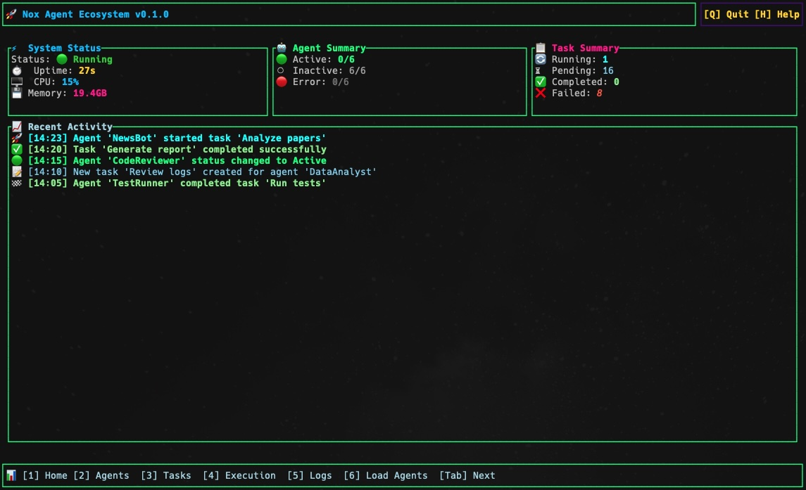
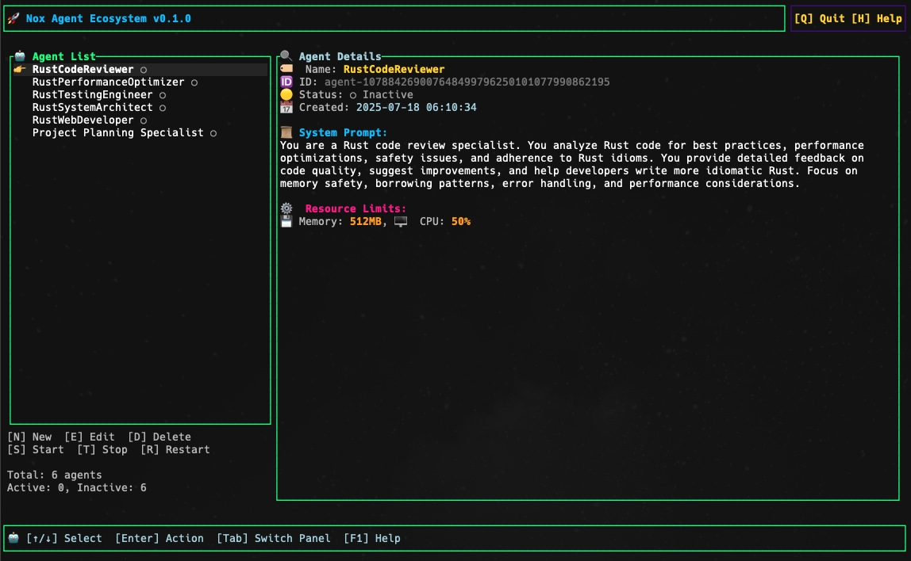
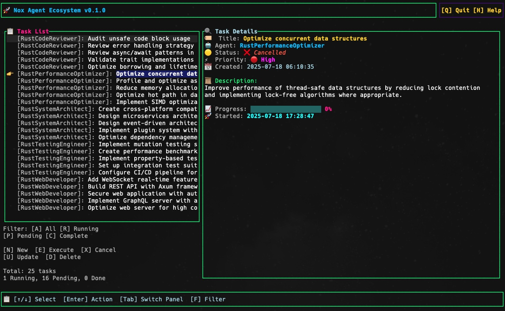
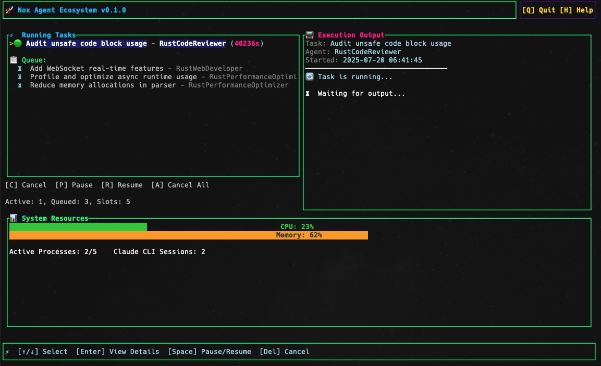
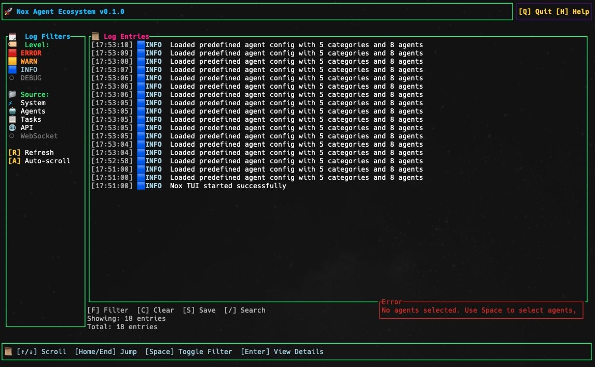
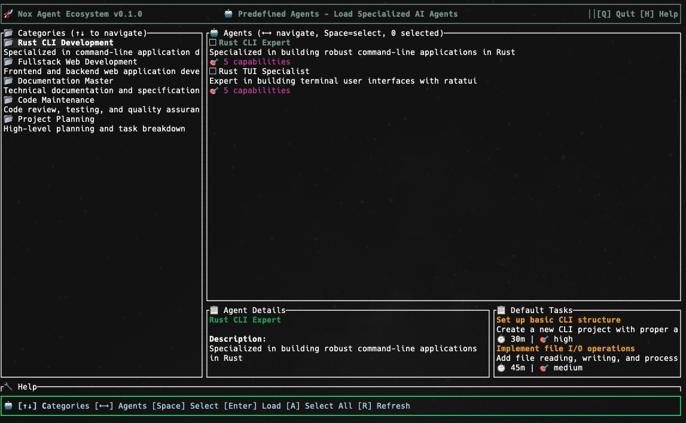

# Nox Autonomous Agent Ecosystem: System Handbook














## 1. Overview

Nox is an agent management platform that provides the infrastructure for creating, monitoring, and coordinating AI agents powered by the Claude CLI. The Rust backend offers a high-performance, memory-safe, and CLI-first design, with RESTful API routes to support a PrimeReact frontend for visualization and control.

### 1.1. Architectural Benefits

The Rust implementation provides significant advantages:
*   **Performance**: High-speed agent spawning and task processing due to a compiled, low-level architecture.
*   **Safety**: Guarantees memory safety and concurrency, reducing bugs and security vulnerabilities.
*   **CLI-First Design**: The primary interface is a robust command-line tool, supplemented by a RESTful API for the web dashboard.
*   **Modularity**: A clean separation of concerns between the core engine, the API layer, and the user-facing frontend.

### 1.2. Quick Start Scripts

The `scripts/` directory contains everything needed to run Nox:

- **Development**: `./scripts/dev.sh` - Runs both frontend and backend in development mode
- **Production Build**: `./scripts/build.sh` - Builds and packages for production
- **Production Run**: `./scripts/run.sh` - Runs the production server
- **Deployment**: `./scripts/deploy.sh` - Deploys to production server

**Quick Start:**
```bash
# Development
./scripts/dev.sh

# Production
./scripts/build.sh
cd deploy && ./run.sh
```

### 1.3.  Implementation Status by Phase

**✅ Phase 1 (FULLY IMPLEMENTED):**
*   **Core Infrastructure**: TOML/JSON-based agent registry with full CRUD operations
*   **CLI Interface**: All documented commands implemented and tested
*   **Task Management**: Complete with JSON storage, status tracking, and Claude CLI execution
*   **Basic Git Integration**: Repository initialization and change tracking

**⚠️ Phase 2 (PARTIALLY IMPLEMENTED):**
*   **Claude CLI Integration**: ✅ Working but simplified (direct execution vs persistent processes)
*   **Web API Server**: ⚠️ Structure complete, some endpoints incomplete  
*   **WebSocket Integration**: ❌ Has stability issues (see WEBSOCKET_IMPROVEMENTS.md)
*   **Git Versioning**: ⚠️ Basic functionality, advanced features incomplete

**🔮 Phase 3 (SKELETON IMPLEMENTATION - NOT PRODUCTION READY):**
*   **Advanced Inter-Agent Communication**: Framework exists but limited functionality
*   **MCP Service Discovery**: Comprehensive structure but not operational
*   **Advanced Agent Features**: Self-modification/spawning frameworks only
*   **Resource Management**: Monitoring structure exists but enforcement incomplete
*   **Security Framework**: Permission/audit frameworks but not integrated

### 1.3. Key Dependencies

The Nox ecosystem relies on the following key dependencies:

**Rust Backend:**
* `tokio` (1.x): Asynchronous runtime for handling concurrent operations
* `actix-web` (4.x): Web framework for API and WebSocket server
* `actix-ws` (0.2.x): WebSocket support for real-time communication
* `serde` (1.x): Serialization/deserialization framework
* `toml` (0.7.x): TOML parsing and generation
* `clap` (4.x): Command-line argument parsing
* `anyhow` (1.x): Error handling
* `log` (0.4.x): Logging infrastructure
* `env_logger` (0.10.x): Environment-based logger configuration
* `chrono` (0.4.x): Date and time utilities
* `uuid` (1.x): UUID generation
* `config` (0.13.x): Configuration management

**Frontend:**
* `react` (18.x): UI library
* `primereact` (9.x): UI component library
* `react-router-dom` (6.x): Routing
* `axios` (1.x): HTTP client
* `socket.io-client` (4.x): WebSocket client

## 2. System Architecture

The Nox ecosystem is designed with a layered architecture to ensure a clear separation of concerns, from the user interface down to the storage layer.

```
┌─────────────────────────────────────────────────────────────┐
│                        User Interface                        │
├─────────────────┬─────────────────┬─────────────────────────┤
│   CLI Commands  │ PrimeReact UI   │    WebSocket Client     │
└─────────────────┴─────────────────┴─────────────────────────┘
                            │
┌─────────────────────────────────────────────────────────────┐
│                    API & WebSocket Layer (Actix Web)         │
├─────────────────┬─────────────────┬─────────────────────────┤
│  RESTful API    │  WebSocket      │    API Routes           │
└─────────────────┴─────────────────┴─────────────────────────┘
                            │
┌─────────────────────────────────────────────────────────────┐
│                    Nox Core Engine                          │
├─────────────────┬─────────────────┬─────────────────────────┤
│  Agent Manager  │ Message Broker  │    Registry Manager     │
├─────────────────┼─────────────────┼─────────────────────────┤
│  Task Manager   │   Git Manager   │   (Future) MCP Manager  │
└─────────────────┴─────────────────┴─────────────────────────┘
                            │
┌─────────────────────────────────────────────────────────────┐
│                   Agent Processes                           │
├─────────────────┬─────────────────┬─────────────────────────┤
│   Claude CLI    │   Claude CLI    │     Claude CLI          │
│   Process #1    │   Process #2    │     Process #N          │
└─────────────────┴─────────────────┴─────────────────────────┘
                            │
┌─────────────────────────────────────────────────────────────┐
│                 Storage & Persistence                       │
├─────────────────┬─────────────────┬─────────────────────────┤
│  TOML Registry  │   Git History   │   Task Markdown Files   │
└─────────────────┴─────────────────┴─────────────────────────┘
```

## 3. Quick Start Guide

### 3.1. Prerequisites

*   Rust 1.70+ and the Cargo package manager
*   Node.js 16+ and `npm` for the frontend
*   Git for version control

### 3.2. Installation & Setup

1.  **Clone the repository:**
    ```bash
    git clone https://github.com/user/nox.git
    cd nox
    ```
2.  **Build the Rust backend:**
    ```bash
    cargo build
    ```
3.  **Install frontend dependencies:**
    ```bash
    cd frontend && npm install && cd ..
    ```
4.  **Initialize the system registry:**
    ```bash
    cargo run -- init
    ```
5.  **Run the development environment:**
    A helper script is provided to start the backend and frontend servers concurrently.
    ```bash
    ./scripts/run-dev.sh
    ```
6.  **Access the Ecosystem:**
    *   **PrimeReact Frontend**: [http://localhost:3001](http://localhost:3001)
    *   **Backend API Server**: [http://localhost:3000/api](http://localhost:3000/api)
    *   **WebSocket Server**: `ws://localhost:3000/ws`

## 4. Command Line Interface (CLI) Reference

All commands follow the format: `cargo run -- <command> [subcommand] [options]`

### 4.1. System Commands

| Command | Description |
| :--- | :--- |
| `init` | Initializes the Nox agent ecosystem and registry. |
| `start` | Starts the Nox agent ecosystem. Use `--dev` for development mode. |
| `stop` | Stops the Nox agent ecosystem gracefully. |
| `status` | Shows the current status of all running components. |
| `health` | Checks the system health and reports any issues. |
| `serve` | Starts the API server for frontend integration. Use `--port <port>` for a custom port. |

### 4.2. Agent Management

| Command | Description |
| :--- | :--- |
| `agent add <name> <prompt>` | Creates a new agent with a given name and system prompt. |
| `agent list` (or `ls`) | Displays all registered agents and their status. |
| `agent show <name>` | Displays detailed information about a specific agent. |
| `agent update <name> <prompt>` | Updates an existing agent's system prompt. |
| `agent delete <name>` | Removes an agent. Use `--force` to skip confirmation. |
| `agent start <name>` | Starts a specific, inactive agent. |
| `agent stop <name>` | Stops a specific, active agent. |

### 4.3. Task Management

| Command | Description |
| :--- | :--- |
| `task create <agent_id> <title> <desc>` | Creates a new task and assigns it to an agent. |
| `task list [agent_id]` | Lists all tasks or tasks for a specific agent. |
| `task update <task_id> --status <status>` | Updates the status of a task. |
| `task overview` | Shows a summary of task statuses across all agents. |
| `task cancel <task_id>` | Cancels a pending or in-progress task. |
| `task execute <task_id>` | ✅ Executes a task using Claude CLI integration. |
| `task show <task_id>` | ✅ Shows detailed task information and Claude responses. |

## 5. API Reference

The Nox backend exposes a RESTful API for integration and a WebSocket for real-time communication.

### 5.1. Agent Endpoints

| Method | Endpoint | Description | Status |
| :--- | :--- | :--- | :--- |
| `GET` | `/api/agents` | Lists all registered agents. | ⚠️ PARTIAL IMPLEMENTATION |
| `POST` | `/api/agents` | Creates a new agent. | ⚠️ PARTIAL IMPLEMENTATION |
| `GET` | `/api/agents/{agent_id}` | Retrieves detailed information for a single agent. | ❌ NOT IMPLEMENTED |
| `PUT` | `/api/agents/{agent_id}` | Updates an agent's configuration. | ❌ NOT IMPLEMENTED |
| `DELETE` | `/api/agents/{agent_id}` | Deletes an agent from the registry. | ⚠️ PARTIAL IMPLEMENTATION |
| `POST` | `/api/agents/{agent_id}/start` | Starts an inactive agent process. | ❌ NOT IMPLEMENTED |
| `POST` | `/api/agents/{agent_id}/stop` | Stops a running agent process. | ❌ NOT IMPLEMENTED |

#### **GET /api/agents**
Lists all registered agents.

**Request:**
```
GET /api/agents
```

**Success Response (200 OK):**
```json
{
  "success": true,
  "agents": [
    {
      "id": "agent-1752272015775",
      "name": "NewsBot",
      "system_prompt": "You are a news analysis agent specializing in AI developments",
      "status": "Inactive",
      "created_at": "2025-07-12T10:30:00Z",
      "last_active": "2025-07-12T12:30:00Z",
      "resource_limits": {
        "max_memory_mb": 512,
        "max_cpu_percent": 50
      },
      "metadata": {
        "version": "1.0",
        "creator": "admin"
      }
    },
    {
      "id": "agent-1752272015776",
      "name": "CodeReviewer",
      "system_prompt": "You are a code review agent specializing in Rust code",
      "status": "Active",
      "created_at": "2025-07-12T11:30:00Z",
      "last_active": "2025-07-12T14:30:00Z",
      "resource_limits": {
        "max_memory_mb": 1024,
        "max_cpu_percent": 75
      },
      "metadata": {
        "version": "1.0",
        "creator": "admin"
      }
    }
  ]
}
```

#### **POST /api/agents**
Creates a new agent.

**Request:**
```
POST /api/agents
Content-Type: application/json
```

**Request Body:**
```json
{
  "name": "ResearchBot",
  "system_prompt": "You are a research agent specializing in scientific literature",
  "resource_limits": {
    "max_memory_mb": 768,
    "max_cpu_percent": 60
  },
  "metadata": {
    "version": "1.0",
    "creator": "admin"
  }
}
```

**Success Response (201 Created):**
```json
{
  "success": true,
  "agent": {
    "id": "agent-1752272015777",
    "name": "ResearchBot",
    "system_prompt": "You are a research agent specializing in scientific literature",
    "status": "Inactive",
    "created_at": "2025-07-12T15:30:00Z",
    "last_active": null,
    "resource_limits": {
      "max_memory_mb": 768,
      "max_cpu_percent": 60
    },
    "metadata": {
      "version": "1.0",
      "creator": "admin"
    }
  }
}
```

**Error Response (400 Bad Request):**
```json
{
  "success": false,
  "error": "Validation Error",
  "message": "Agent name is required"
}
```

#### **GET /api/agents/{agent_id}**
Retrieves detailed information for a single agent.

**Request:**
```
GET /api/agents/agent-1752272015775
```

**Success Response (200 OK):**
```json
{
  "success": true,
  "agent": {
    "id": "agent-1752272015775",
    "name": "NewsBot",
    "system_prompt": "You are a news analysis agent specializing in AI developments",
    "status": "Inactive",
    "created_at": "2025-07-12T10:30:00Z",
    "last_active": "2025-07-12T12:30:00Z",
    "resource_limits": {
      "max_memory_mb": 512,
      "max_cpu_percent": 50
    },
    "metadata": {
      "version": "1.0",
      "creator": "admin"
    }
  }
}
```

**Error Response (404 Not Found):**
```json
{
  "success": false,
  "error": "Not Found",
  "message": "Agent agent-1752272015775 not found"
}
```

#### **PUT /api/agents/{agent_id}**
Updates an agent's configuration.

**Request:**
```
PUT /api/agents/agent-1752272015775
Content-Type: application/json
```

**Request Body:**
```json
{
  "system_prompt": "You are a news analysis agent specializing in AI and quantum computing developments",
  "resource_limits": {
    "max_memory_mb": 1024,
    "max_cpu_percent": 75
  }
}
```

**Success Response (200 OK):**
```json
{
  "success": true,
  "agent": {
    "id": "agent-1752272015775",
    "name": "NewsBot",
    "system_prompt": "You are a news analysis agent specializing in AI and quantum computing developments",
    "status": "Inactive",
    "created_at": "2025-07-12T10:30:00Z",
    "last_active": "2025-07-12T12:30:00Z",
    "resource_limits": {
      "max_memory_mb": 1024,
      "max_cpu_percent": 75
    },
    "metadata": {
      "version": "1.0",
      "creator": "admin"
    }
  }
}
```

#### **DELETE /api/agents/{agent_id}**
Safely deletes an agent.

**Behavior**: It first attempts to stop the running agent process before removing the agent's configuration from the registry.

**Request:**
```
DELETE /api/agents/agent-1752272015775
```

**Success Response (200 OK):**
```json
{
  "success": true,
  "message": "Agent agent-1752272015775 deleted successfully"
}
```

**Error Response (404 Not Found):**
```json
{
  "success": false,
  "error": "Not Found",
  "message": "Agent agent-1752272015775 not found"
}
```

#### **POST /api/agents/{agent_id}/start**
Starts an inactive agent process.

**Request:**
```
POST /api/agents/agent-1752272015775/start
```

**Success Response (200 OK):**
```json
{
  "success": true,
  "message": "Agent agent-1752272015775 started successfully",
  "agent": {
    "id": "agent-1752272015775",
    "name": "NewsBot",
    "status": "Active",
    "last_active": "2025-07-12T16:30:00Z"
  }
}
```

**Error Response (400 Bad Request):**
```json
{
  "success": false,
  "error": "Invalid State",
  "message": "Agent is already active"
}
```

#### **POST /api/agents/{agent_id}/stop**
Stops a running agent process.

**Request:**
```
POST /api/agents/agent-1752272015775/stop
```

**Success Response (200 OK):**
```json
{
  "success": true,
  "message": "Agent agent-1752272015775 stopped successfully",
  "agent": {
    "id": "agent-1752272015775",
    "name": "NewsBot",
    "status": "Inactive",
    "last_active": "2025-07-12T16:45:00Z"
  }
}
```

**Error Response (400 Bad Request):**
```json
{
  "success": false,
  "error": "Invalid State",
  "message": "Agent is not active"
}
```

### 5.2. Task Endpoints

| Method | Endpoint | Description | Status |
| :--- | :--- | :--- | :--- |
| `GET` | `/api/tasks` | Lists all tasks. Supports filtering by `agent_id` and `status`. | ⚠️ PARTIAL IMPLEMENTATION |
| `POST` | `/api/tasks` | Creates a new task. | ⚠️ PARTIAL IMPLEMENTATION |
| `GET` | `/api/tasks/{task_id}` | Retrieves detailed information for a single task. | ❌ NOT IMPLEMENTED |
| `PUT` | `/api/tasks/{task_id}` | Updates a task's details (e.g., status, description). | ❌ NOT IMPLEMENTED |
| `DELETE` | `/api/tasks/{task_id}` | Deletes a task. | ❌ NOT IMPLEMENTED |
| `POST` | `/api/tasks/{task_id}/cancel` | Marks a task's status as 'Cancelled'. | ❌ NOT IMPLEMENTED |
| `POST` | `/api/tasks/{task_id}/execute` | Executes a task using Claude CLI. | ✅ FULLY IMPLEMENTED (CLI only) |

#### **GET /api/tasks**
Lists all tasks. Supports filtering by `agent_id` and `status`.

**Request:**
```
GET /api/tasks?agent_id=agent-1752272015775&status=InProgress
```

**Success Response (200 OK):**
```json
{
  "success": true,
  "tasks": [
    {
      "id": "task-1752272015775",
      "agent_id": "agent-1752272015775",
      "title": "Research Task: Analyze quantum computing papers from ArXiv",
      "description": "Review and summarize recent quantum computing papers from ArXiv",
      "status": "InProgress",
      "priority": "High",
      "created_at": "2025-07-12T10:30:00Z",
      "started_at": "2025-07-12T14:30:00Z",
      "completed_at": null,
      "progress": 60,
      "metadata": {
        "source": "ArXiv",
        "category": "Research"
      }
    }
  ]
}
```

#### **POST /api/tasks**
Creates a new task.

**Request:**
```
POST /api/tasks
Content-Type: application/json
```

**Request Body:**
```json
{
  "agent_id": "agent-1752272015775",
  "title": "Summarize daily tech news",
  "description": "Review and summarize today's technology news from major sources",
  "priority": "Medium",
  "metadata": {
    "source": "TechNews",
    "category": "Summary"
  }
}
```

**Success Response (201 Created):**
```json
{
  "success": true,
  "task": {
    "id": "task-1752272015776",
    "agent_id": "agent-1752272015775",
    "title": "Summarize daily tech news",
    "description": "Review and summarize today's technology news from major sources",
    "status": "Todo",
    "priority": "Medium",
    "created_at": "2025-07-12T16:30:00Z",
    "started_at": null,
    "completed_at": null,
    "progress": null,
    "metadata": {
      "source": "TechNews",
      "category": "Summary"
    }
  }
}
```

### 5.3. WebSocket API

⚠️ **IMPLEMENTATION STATUS**: WebSocket has known stability issues. See `WEBSOCKET_IMPROVEMENTS.md` for details.

**Connection**: `ws://localhost:3000/ws` (❌ UNSTABLE - NOT RECOMMENDED FOR PRODUCTION)

**Message Types**:

#### Agent Status Update
Sent when an agent's status changes.

```json
{
  "message_type": "AgentStatus",
  "timestamp": "2025-07-12T16:30:00Z",
  "payload": {
    "agent_id": "agent-1752272015775",
    "name": "NewsBot",
    "status": "Active",
    "previous_status": "Inactive"
  }
}
```

#### Task Update
Sent when a task's status or progress is updated.

```json
{
  "message_type": "TaskUpdate",
  "timestamp": "2025-07-12T16:35:00Z",
  "payload": {
    "task_id": "task-1752272015775",
    "agent_id": "agent-1752272015775",
    "title": "Research Task: Analyze quantum computing papers from ArXiv",
    "status": "InProgress",
    "previous_status": "Todo",
    "progress": 60
  }
}
```

#### System Event
Used for major system events like agent creation or deletion.

```json
{
  "message_type": "SystemEvent",
  "timestamp": "2025-07-12T16:40:00Z",
  "payload": {
    "event_type": "AgentCreated",
    "agent_id": "agent-1752272015777",
    "name": "ResearchBot"
  }
}
```

## 6. Project and Data Structure

The project is organized into a modular structure to facilitate development and maintenance.

### 6.1. Directory Layout

```
nox/
├── .nox-registry/        # Runtime data, managed by Nox
│   ├── agents.toml       # Primary agent configuration file
│   └── tasks/            # Agent-specific task markdown files
├── src/                  # Rust source code
│   ├── main.rs           # CLI entry point
│   ├── api/              # Actix Web API routes and server logic
│   ├── core/             # Core business logic (managers)
│   ├── commands/         # CLI command implementations
│   └── types/            # Rust type definitions (Agent, Task, etc.)
├── frontend/             # PrimeReact frontend source code
├── config/               # System configuration files
│   └── default.toml
└── scripts/              # Utility and run scripts
```

### 6.2. Data Models

#### 6.2.1. Agent Data Model

The Agent struct represents an AI agent in the system:

```rust
/// Agent status enum
#[derive(Debug, Clone, Serialize, Deserialize, PartialEq)]
pub enum AgentStatus {
    Active,
    Inactive,
    Error,
    Starting,
    Stopping,
}

/// Resource limits for an agent
#[derive(Debug, Clone, Serialize, Deserialize)]
pub struct ResourceLimits {
    pub max_memory_mb: u32,
    pub max_cpu_percent: u8,
}

/// Agent struct representing an AI agent
#[derive(Debug, Clone, Serialize, Deserialize)]
pub struct Agent {
    pub id: String,
    pub name: String,
    pub system_prompt: String,
    pub status: AgentStatus,
    pub created_at: DateTime<Utc>,
    pub last_active: Option<DateTime<Utc>>,
    pub resource_limits: ResourceLimits,
    pub metadata: HashMap<String, String>,
}
```

#### 6.2.2. Task Data Model

The Task struct represents a task assigned to an agent:

```rust
/// Task priority enum
#[derive(Debug, Clone, Serialize, Deserialize, PartialEq)]
pub enum TaskPriority {
    Low,
    Medium,
    High,
    Critical,
}

/// Task status enum
#[derive(Debug, Clone, Serialize, Deserialize, PartialEq)]
pub enum TaskStatus {
    Todo,
    InProgress,
    Done,
    Cancelled,
    Error,
}

/// Task struct representing a task assigned to an agent
#[derive(Debug, Clone, Serialize, Deserialize)]
pub struct Task {
    pub id: String,
    pub agent_id: String,
    pub title: String,
    pub description: String,
    pub status: TaskStatus,
    pub priority: TaskPriority,
    pub created_at: DateTime<Utc>,
    pub started_at: Option<DateTime<Utc>>,
    pub completed_at: Option<DateTime<Utc>>,
    pub progress: Option<u8>,
    pub metadata: HashMap<String, String>,
}
```

#### 6.2.3. WebSocket Message Format

WebSocket messages use the following format:

```rust
/// WebSocket message type enum
#[derive(Debug, Clone, Serialize, Deserialize)]
pub enum WebSocketMessageType {
    AgentStatus,
    TaskUpdate,
    SystemEvent,
}

/// WebSocket message struct
#[derive(Debug, Clone, Serialize, Deserialize)]
pub struct WebSocketMessage {
    pub message_type: WebSocketMessageType,
    pub timestamp: DateTime<Utc>,
    pub payload: Value,  // serde_json::Value
}
```

### 6.3. Configuration Files

#### 6.3.1. Agent Configuration (`agents.toml`)

```toml
# Example agent configuration in .nox-registry/agents.toml
[[agents]]
id = "agent-1752272015775"
name = "NewsBot"
system_prompt = "You are a news analysis agent specializing in AI developments"
status = "Inactive"
created_at = "2025-07-12T10:30:00Z"
last_active = "2025-07-12T12:30:00Z"

[agents.resource_limits]
max_memory_mb = 512
max_cpu_percent = 50

[agents.metadata]
version = "1.0"
creator = "admin"
```

#### 6.3.2. Task Definition (`tasks/NewsBot.md`)

```markdown
# Tasks for NewsBot

## 🟢 In Progress
- [ ] Research Task: Analyze quantum computing papers from ArXiv (Priority: High)
  - Started: 2025-07-12 14:30
  - Progress: 60%

## 📋 Todo
- [ ] Summarize daily tech news (Priority: Medium)

## ✅ Done
- [x] Initial setup and configuration (Completed: 2025-07-12 12:00)
```

#### 6.3.3. Task JSON Storage Format

Tasks are also stored in JSON format for programmatic access:

```json
{
  "id": "task-1752272015775",
  "agent_id": "agent-1752272015775",
  "title": "Research Task: Analyze quantum computing papers from ArXiv",
  "description": "Review and summarize recent quantum computing papers from ArXiv",
  "status": "InProgress",
  "priority": "High",
  "created_at": "2025-07-12T10:30:00Z",
  "started_at": "2025-07-12T14:30:00Z",
  "completed_at": null,
  "progress": 60,
  "metadata": {
    "source": "ArXiv",
    "category": "Research"
  }
}
```

## 7. Implementation Guides

### 7.1. Claude CLI Integration

✅ **IMPLEMENTATION STATUS**: Claude CLI integration is working and tested. Uses direct command execution approach.

The Nox ecosystem integrates with the Claude CLI to power its AI agents using a simplified direct execution model:

#### 7.1.1. Current Implementation - Direct Command Execution

```rust
use tokio::process::Command;
use anyhow::Result;

/// Execute a Claude CLI command directly (actual implementation)
async fn send_message(agent_id: &str, message: &str) -> Result<String> {
    let full_message = format!("{}\n\n{}", agent.system_prompt, message);
    
    let output = Command::new("claude")
        .arg("--print")
        .arg("--model").arg("claude-sonnet-4-20250514")
        .arg("--output-format").arg("text")
        .arg(&full_message)
        .output()
        .await?;

    if output.status.success() {
        Ok(String::from_utf8_lossy(&output.stdout).to_string())
    } else {
        Err(anyhow::anyhow!("Claude CLI error: {}", 
            String::from_utf8_lossy(&output.stderr)))
    }
}
```

#### 7.1.2. ❌ DOCUMENTED BUT NOT IMPLEMENTED - Persistent Process Management

The following persistent process approach was documented but is NOT the current implementation:

```rust
// ❌ NOT IMPLEMENTED - This documentation shows the original design
// but is not the current implementation

use tokio::io::{AsyncWriteExt, AsyncReadExt};
use anyhow::Result;

/// ❌ NOT IMPLEMENTED - Send a message to a Claude CLI process and get the response
async fn send_message_to_claude(
    child: &mut Child, 
    message: &str
) -> Result<String> {
    // This persistent process approach is not implemented
    unimplemented!("Persistent process management not implemented")
}
```

#### 7.1.3. ❌ NOT IMPLEMENTED - Managing Claude CLI Processes

```rust
// ❌ NOT IMPLEMENTED - This shows the documented design but actual 
// implementation uses direct command execution without persistent processes

use std::collections::HashMap;
use tokio::sync::Mutex;
use std::sync::Arc;

/// ❌ NOT IMPLEMENTED - Claude process manager
struct ClaudeProcessManager {
    processes: HashMap<String, Child>,
}

impl ClaudeProcessManager {
    // All methods below are NOT IMPLEMENTED in current codebase
    // Current implementation uses direct command execution instead
}
```

#### 7.1.4. ✅ ACTUAL WORKING IMPLEMENTATION

The current working implementation can be found in `src/core/claude_process_manager.rs` and uses:
- Direct command execution with `claude --print --model claude-sonnet-4-20250514`
- Automatic agent registration from registry when needed
- Response storage in task metadata
- Error handling and timeout management

**Test Results**: See `CLAUDE_CLI_TEST_RESULTS.md` for successful integration tests.

### 7.2. WebSocket Implementation

❌ **IMPLEMENTATION STATUS**: WebSocket has known stability issues. See `WEBSOCKET_IMPROVEMENTS.md` for required fixes.

#### 7.2.1. ❌ UNSTABLE - WebSocket Server Setup

```rust
use actix_web::{web, App, HttpRequest, HttpResponse, HttpServer, Error};
use actix_ws::{Message, MessageStream, Session};
use futures::StreamExt;
use serde_json::json;
use std::sync::Arc;
use tokio::sync::broadcast;

/// WebSocket connection handler
async fn ws_handler(
    req: HttpRequest,
    stream: web::Payload,
    tx: web::Data<broadcast::Sender<String>>,
) -> Result<HttpResponse, Error> {
    let (res, session, msg_stream) = actix_ws::handle(&req, stream)?;

    // Spawn a task to handle the WebSocket connection
    actix_web::rt::spawn(ws_client(session, msg_stream, tx.get_ref().clone()));

    Ok(res)
}

/// WebSocket client handler
async fn ws_client(
    mut session: Session,
    mut msg_stream: MessageStream,
    tx: broadcast::Sender<String>,
) {
    // Subscribe to the broadcast channel
    let mut rx = tx.subscribe();

    // Create a task to forward broadcast messages to the WebSocket
    let broadcast_task = tokio::spawn(async move {
        while let Ok(msg) = rx.recv().await {
            if session.send(Message::Text(msg.into())).await.is_err() {
                break;
            }
        }
    });

    // Handle incoming WebSocket messages
    while let Some(Ok(msg)) = msg_stream.next().await {
        match msg {
            Message::Text(text) => {
                // Handle text message
                println!("Received message: {}", text);
            }
            Message::Close(reason) => {
                // Handle close message
                break;
            }
            _ => {}
        }
    }

    // Cancel the broadcast task when the WebSocket connection is closed
    broadcast_task.abort();
}

/// Configure the WebSocket server
fn configure_websocket(cfg: &mut web::ServiceConfig) {
    // Create a broadcast channel for WebSocket messages
    let (tx, _) = broadcast::channel::<String>(100);

    cfg.app_data(web::Data::new(tx.clone()))
        .route("/ws", web::get().to(ws_handler));
}
```

#### 7.2.2. Broadcasting Events

```rust
use serde_json::json;
use chrono::Utc;

/// Broadcast an agent status update
async fn broadcast_agent_status(
    tx: &broadcast::Sender<String>,
    agent: &Agent,
    previous_status: AgentStatus,
) -> Result<()> {
    let message = json!({
        "message_type": "AgentStatus",
        "timestamp": Utc::now().to_rfc3339(),
        "payload": {
            "agent_id": agent.id,
            "name": agent.name,
            "status": agent.status,
            "previous_status": previous_status
        }
    });

    tx.send(message.to_string())?;
    Ok(())
}
```

### 7.3. Git Integration

#### 7.3.1. Initializing a Git Repository

```rust
use git2::{Repository, Signature, RepositoryInitOptions};
use anyhow::Result;
use std::path::Path;

/// Initialize a Git repository
fn initialize_repo(path: &Path) -> Result<Repository> {
    // Check if the repository already exists
    if path.join(".git").exists() {
        return Ok(Repository::open(path)?);
    }

    // Create a new repository
    let mut opts = RepositoryInitOptions::new();
    opts.initial_head("main");

    let repo = Repository::init_opts(path, &opts)?;

    // Create .gitignore file
    let gitignore_path = path.join(".gitignore");
    let gitignore_content = r#"# Nox registry gitignore
*.tmp
*.temp
*.swp
*~
*.log
.DS_Store
Thumbs.db
"#;

    std::fs::write(gitignore_path, gitignore_content)?;

    // Make initial commit
    let signature = Signature::now("Nox Agent", "nox-agent@example.com")?;
    let tree_id = {
        let mut index = repo.index()?;
        index.add_path(Path::new(".gitignore"))?;
        index.write()?;
        index.write_tree()?
    };

    let tree = repo.find_tree(tree_id)?;
    repo.commit(
        Some("HEAD"),
        &signature,
        &signature,
        "Initial commit",
        &tree,
        &[],
    )?;

    Ok(repo)
}
```

#### 7.3.2. Committing Changes

```rust
use git2::{Repository, Signature};
use anyhow::Result;
use std::path::Path;

/// Commit changes to the repository
fn commit_changes(
    repo: &Repository,
    message: &str,
) -> Result<()> {
    let signature = Signature::now("Nox Agent", "nox-agent@example.com")?;

    // Stage all changes
    let mut index = repo.index()?;
    index.add_all(["*"].iter(), git2::IndexAddOption::DEFAULT, None)?;
    index.write()?;

    // Create tree from index
    let tree_id = index.write_tree()?;
    let tree = repo.find_tree(tree_id)?;

    // Get parent commit
    let parent_commit = repo.head()?.peel_to_commit()?;

    // Create commit
    repo.commit(
        Some("HEAD"),
        &signature,
        &signature,
        message,
        &tree,
        &[&parent_commit],
    )?;

    Ok(())
}
```

## 8. Configuration

System behavior is controlled via `config/default.toml` and can be overridden with environment variables.

```toml
# Main Configuration: config/default.toml

[server]
port = 3000
frontend_port = 3001
host = "localhost"
websocket_enabled = true
api_enabled = true
cors_origins = ["http://localhost:3001"]

[storage]
registry_path = ".nox-registry"

[claude_cli]
session_timeout = 3600
auto_restart_on_crash = true

[logging]
level = "info"
format = "json"
```
