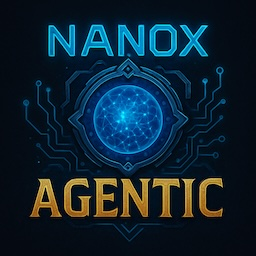

# Nox - Agent Management Ecosystem



**🚧 Current Status: TypeScript Prototype - Planning Rust Rewrite 🚧**

Nox is an agent management platform that provides infrastructure for creating, monitoring, and coordinating AI agents powered by Claude CLI. The current TypeScript implementation serves as a foundation for a future Rust-based CLI and web dashboard.

## Current Implementation Status

This TypeScript version includes:
- ✅ **Agent Registry Management**: JSON-based agent configuration storage
- ✅ **Task Management System**: Markdown-based task tracking per agent  
- ✅ **Web Dashboard**: React frontend for agent/task visualization
- ✅ **WebSocket Integration**: Real-time updates between frontend and backend
- ✅ **CLI Interface**: Command-line tools for agent management
- ✅ **Basic Claude CLI Integration**: Agent spawning and communication
- ⚠️ **Git-based Versioning**: Partial implementation
- ⚠️ **MCP Service Discovery**: Framework exists but needs completion
- ⚠️ **Inter-Agent Communication**: Basic protocol defined but not fully implemented

## Planned Architecture (Rust Rewrite)

The next iteration will be built in Rust for:
- **Performance**: Faster agent spawning and task processing
- **Safety**: Memory safety and robust error handling  
- **CLI-First Design**: Primary interface will be CLI with optional web dashboard
- **Modularity**: Clean separation between core engine and UI components

## Current Working Features

### Agent Management
- **Agent Creation**: Create agents with custom system prompts and capabilities
- **Agent Registry**: JSON-based storage with agent configurations and metadata
- **Agent Lifecycle**: Start, stop, restart, and delete agents
- **Status Monitoring**: Track agent health, memory usage, and activity

### Task Management  
- **Task Creation**: Assign tasks to specific agents with priorities and deadlines
- **Markdown Tracking**: Each agent maintains a markdown file with their task list
- **Task Status Updates**: Todo → In Progress → Done workflow
- **Cross-Agent Tasks**: Tasks can be delegated between agents
- **Task History**: Complete audit trail of task creation and completion

### Web Dashboard
- **Agent Overview**: Visual grid of all agents with status indicators
- **Task Visualization**: Dashboard showing task distribution and progress
- **Real-time Updates**: WebSocket-powered live updates without page refresh
- **Agent Controls**: Create, delete, start/stop agents through web interface
- **Auto-refresh**: Optional periodic refresh of agent data

### CLI Interface
```bash
# Agent management
node dist/nox.js add-agent <name> <systemPrompt>
node dist/nox.js list-agents
node dist/nox.js delete-agent <name>
node dist/nox.js show-agent <name>

# Task management  
node dist/nox.js create-task <agentId> <title> <description>
node dist/nox.js list-tasks [agentId]
node dist/nox.js update-task <taskId>
node dist/nox.js task-overview

# System operations
node dist/nox.js init        # Initialize Nox ecosystem
node dist/nox.js start       # Start the ecosystem  
node dist/nox.js stop        # Stop all agents
node dist/nox.js status      # Show system status
node dist/nox.js health      # Health check
```

## Current System Architecture

### File Structure
```
.nox-registry/
├── agents.json              # Agent configurations and metadata
├── agent-relationships.json # Agent connection tracking
├── mcp-services.json         # MCP service registry (planned)
├── agents/                   # Individual agent directories
├── tasks/                    # Task markdown files per agent  
├── conversations/            # Agent conversation logs
└── .git/                     # Version control (partial)
```

### Agent Configuration Format
```json
{
  "id": "agent-1234567890",
  "name": "research-assistant", 
  "systemPrompt": "You are a research assistant...",
  "status": "inactive",
  "capabilities": ["research", "analysis", "writing"],
  "resourceLimits": {
    "maxMemoryMB": 2048,
    "maxCPUPercent": 50,
    "maxConcurrentTasks": 10
  },
  "createdAt": "2024-01-15T10:30:00Z",
  "lastModified": "2024-01-15T10:30:00Z"
}
```

### Task Tracking Example
```markdown
# Tasks for research_assistant

## 🟢 In Progress
- [ ] Analyze quantum computing papers (Priority: HIGH)
  - Started: 2024-01-15 14:30
  - Progress: 60%

## 📋 Todo  
- [ ] Create literature review (Priority: MEDIUM)
- [ ] Help with data visualization (Priority: LOW)

## ✅ Done
- [x] Research methodology setup (Completed: 2024-01-15 12:00)
```

## Setup and Installation

### Prerequisites
```bash
# Required software
- Node.js 18+ with npm
- Claude CLI installed and configured
- Git (for version control)
- Docker (for future MCP services)
```

### Installation Steps
```bash
# 1. Clone repository
git clone https://github.com/user/nox.git
cd nox

# 2. Install dependencies
npm install

# 3. Build TypeScript
npm run build

# 4. Initialize system
node dist/nox.js init

# 5. Start the ecosystem
node dist/nox.js start
```

### Development Setup
```bash
# Run in development mode
npm run dev

# Start dashboard only
npm run build && node dist/nox.js start
# Dashboard available at http://localhost:3001
# WebSocket server at ws://localhost:3000
```

## Configuration

### Main Configuration (nox.config.json)
```json
{
  "system": {
    "name": "nox-ecosystem",
    "workingDirectory": "/path/to/nox"
  },
  "server": {
    "port": 3000,
    "dashboardPort": 3001
  },
  "agents": {
    "maxConcurrent": 10,
    "defaultTimeout": 300000
  },
  "claude": {
    "model": "claude-3-5-sonnet-20241022",
    "timeout": 30000
  }
}
```

## Known Issues and Limitations

### Current TypeScript Implementation Issues
- ⚠️ **Agent Creation**: Intermittent 500 errors in web dashboard
- ⚠️ **Task Management**: Race conditions between task deletion and updates
- ⚠️ **Server Stability**: Unhandled promise rejections can crash the server
- ⚠️ **Error Handling**: Inconsistent error message formatting
- ⚠️ **WebSocket Connections**: Connection failures under load

### Missing Features (Planned for Rust Rewrite)
- ❌ **Inter-Agent Communication**: Only basic framework exists
- ❌ **MCP Service Discovery**: Infrastructure planned but not implemented
- ❌ **Agent Self-Modification**: Conceptual design only
- ❌ **Advanced Registry Queries**: Simple lookups only
- ❌ **Git Versioning**: Partial implementation
- ❌ **Resource Limits**: Basic limits defined but not enforced
- ❌ **Claude CLI Integration**: Connection issues and timeout handling

### Frontend Dashboard Limitations
- Limited error feedback to users
- No real-time task progress indicators  
- Basic styling and UX
- Auto-refresh functionality has bugs
- Task output display incomplete

## Future Rust Architecture

### Planned Benefits
- **Performance**: Compiled binary vs interpreted TypeScript
- **Memory Safety**: Rust's ownership model prevents crashes
- **Better Error Handling**: Comprehensive Result<T, E> error handling
- **CLI-First Design**: Primary interface will be CLI, not web dashboard
- **Modular Architecture**: Clean separation of concerns

### Rust Implementation Plan
```rust
// Core modules planned
nox-cli/           # Primary CLI interface
nox-core/          # Agent management engine
nox-registry/      # Agent registry and storage
nox-tasks/         # Task management system
nox-web/          # Optional web dashboard
nox-integrations/ # Claude CLI and MCP integrations
```

### Migration Strategy
1. **Phase 1**: Core CLI in Rust with basic agent management
2. **Phase 2**: Task system and Claude CLI integration
3. **Phase 3**: Web dashboard (optional, simpler than current)
4. **Phase 4**: Advanced features (MCP, inter-agent communication)

The Rust rewrite will focus on **reliability and simplicity** rather than the ambitious features outlined in the current documentation.

## Package.json Scripts

Current build and run scripts:
```json
{
  "scripts": {
    "build": "tsc",
    "start": "node dist/nox.js start",
    "dev": "ts-node src/nox.ts start --dev",
    "init": "node dist/nox.js init",
    "add-agent": "node dist/nox.js add-agent",
    "list-agents": "node dist/nox.js list-agents",
    "delete-agent": "node dist/nox.js delete-agent",
    "test": "jest",
    "lint": "eslint src/**/*.ts",
    "typecheck": "tsc --noEmit"
  }
}
```

## Tech Stack

### Current Implementation
- **Backend**: Node.js 18+ with TypeScript
- **CLI Framework**: Commander.js
- **Web Server**: Express.js
- **Frontend**: React with TypeScript
- **Real-time**: WebSocket (ws library)
- **Storage**: JSON files with file watching
- **Version Control**: Simple Git integration
- **Process Management**: Basic child process spawning

### Dependencies
```json
{
  "dependencies": {
    "commander": "^11.1.0",
    "express": "^4.18.2", 
    "ws": "^8.14.2",
    "chokidar": "^3.5.3",
    "simple-git": "^3.19.1",
    "uuid": "^9.0.1"
  },
  "devDependencies": {
    "@types/node": "^20.8.10",
    "typescript": "^5.2.2",
    "ts-node": "^10.9.1"
  }
}
```

## Troubleshooting

### Common Issues

**Port Conflicts**:
```bash
# Kill processes on ports 3000/3001
lsof -ti:3000 | xargs kill -9 2>/dev/null || true
lsof -ti:3001 | xargs kill -9 2>/dev/null || true
```

**Server Won't Start**:
```bash
# Check if build is up to date
npm run build

# Check configuration file exists
ls -la nox.config.json

# Start with verbose logging
node dist/nox.js start --config nox.config.json
```

**Dashboard 500 Errors**:
- Agent creation may fail intermittently
- Check server logs for detailed error messages
- Restart the server if issues persist

## Contributing

This TypeScript implementation serves as a prototype. The focus is now shifting to a Rust rewrite for better performance and reliability.

### Current Development Status
- ⏸️ **TypeScript version**: Feature freeze, bug fixes only
- 🚧 **Rust version**: In planning phase
- 📋 **Documentation**: Being updated to reflect actual functionality

## License

MIT License - See LICENSE file for details.

---

**Note**: This documentation reflects the current state of the TypeScript prototype. Many advanced features described in earlier versions are conceptual designs that will be implemented in the planned Rust rewrite.
